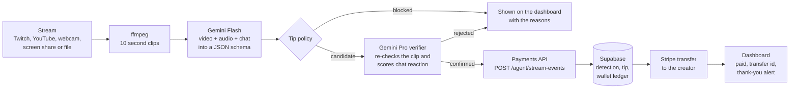

# Suparade

**Product placement for live streams, run by AI agents.**

A brand funds a campaign. A scout agent watches live streams with Gemini (video, audio and chat together) and spots the moment a streamer drinks, shows or praises the product. A second, stricter Gemini pass verifies the moment. A tipper step then pays the streamer a real Stripe transfer out of the campaign budget held in Supabase, and a thank-you alert appears on the stream.

Built at the Supabase Select Hackathon (October 3, 2026) for the prompt *"build something agents want."*

## Why agents want this

Product placement works in film: a laptop appears in a scene because the brand paid the producer. Live streaming has no equivalent that works moment by moment and at small scale. A brand's marketing agent that wanted to do it would be missing two things:

| Tool the agent needs | What Suparade gives it |
| --- | --- |
| **Brand sightings.** "Where did my brand just appear, and what happened?" | Structured detections from live video: category, quote, brand, sentiment, confidence, timestamp, an evidence clip and a thumbnail with bounding boxes. |
| **Creator tips.** "Pay this creator this amount, with this message." | A payment API with the guardrails built in: campaign budget, per-tip cap, one tip per detection, idempotent Stripe transfers. |

The agent is the user. The dashboard is the human side: it is where a person starts a stream session and watches what the agent decided and paid.

## How it works



1. **Watch.** The stream is cut into 10 second clips. Each clip goes to Gemini with its video, its audio and the live chat posted during it.
2. **Detect.** Gemini returns a structured `ClipAnalysis`: beverage moments, brand screen time with prominence, brand-safety flags, whether the footage looks live, and a one-line summary passed to the next clip as context.
3. **Decide.** The tip policy blocks sarcastic or negative mentions, competitor brands, animation and replays, staged moments, unsafe clips, repeats and anything inside the cooldown. Blocked moments stay visible with their reasons.
4. **Verify.** Each candidate is re-checked by a stronger Gemini model with a sceptical auditor prompt, together with the chat around the moment. A strong audience reaction raises the tip.
5. **Pay.** The payments API logs the moment in Supabase, reserves the tip against the campaign budget under a row lock, and sends a Stripe transfer to the creator's connected account.
6. **Show.** The dashboard shows the flag go `verifying`, `paying`, then `paid` with the Stripe transfer id. In demo mode Gemini also writes, speaks and illustrates a thank-you alert.

## What is in this repo

| Part | Folder | What it does | Runs on |
| --- | --- | --- | --- |
| Gemini detector | `backend/` | Cuts streams into clips, Gemini analysis, tip policy, verifier, chat reaction, evidence, thank-you alerts | Laptop or VM (needs ffmpeg), port 8000 |
| Dashboard | `frontend/` | React and Vite monitor: stream tiles, flag feed, chat, evidence with bounding boxes | Port 5173 |
| Payments API | `app/`, `api/` | Campaign budgets, creators, detections and tips; Stripe Connect payouts; Link funding checkout | Vercel, or locally on port 8001 |
| Database | `supabase/migrations/` | Tables, money functions, row level security, Realtime publication | Supabase |
| Scripts | `scripts/` | One-command end to end run, demo seed, Stripe check | Local |

## Built with

| Technology | How Suparade uses it |
| --- | --- |
| **Supabase** | Postgres is the system of record for brands, campaigns, creators, videos, detections, tips and an append-only wallet ledger. Three `security definer` SQL functions hold every money rule. Row level security scopes brand data to its owner. Auth verifies dashboard users. The `tips` table is published to Realtime so an overlay can react the moment a tip is paid. |
| **Gemini** | Flash analyses every clip (video and audio) into a JSON schema. Pro verifies each candidate and scores audience reaction from chat. Gemini also draws bounding boxes on evidence thumbnails, writes the thank-you line, speaks it (TTS) and generates a thank-you card. |
| **Stripe** | Connect (Accounts v2, Express dashboard) pays creators by transfer, each with an idempotency key and the agent's reason in the description. Checkout plus a webhook tops up campaign budgets, designed to be paid by a Link Agent Wallet spend request. |
| **Vercel** | Hosts the payments API as a Python function (`api/index.py`, `vercel.json`). |

## Quick start

You need Python 3.9+ (3.11+ recommended), Node 18+, ffmpeg, a Gemini API key, a Supabase project and a Stripe sandbox key. The one-time setup (migrations, seeded campaign, onboarded demo creator) is in [docs/SETUP.md](docs/SETUP.md).

```bash
cp .env.example .env                    # Supabase and Stripe keys, agent key
cp backend/.env.example backend/.env    # GEMINI_API_KEY and SUPARADE_CAMPAIGN_ID
./scripts/run_e2e.sh
```

The script starts the payments API (port 8001), the detector (port 8000) and the dashboard (port 5173), tops up the sandbox budget if it is low, sends one $0.50 test tip to prove the money path, then plays the demo stream with real Gemini analysis and real Stripe sandbox payouts. Pass a file path or a Twitch or YouTube live URL to watch something else.

To try detection alone, without Supabase or Stripe, leave `SUPARADE_API_URL` empty in `backend/.env`. Tips are then simulated.

## Documentation

| Page | What it covers |
| --- | --- |
| [docs/HACKATHON.md](docs/HACKATHON.md) | Submission write-up: the idea, fit with the prompt, sponsor technology, demo walkthrough, what is real and what is not, roadmap |
| [docs/ARCHITECTURE.md](docs/ARCHITECTURE.md) | Components, the life of one moment, event states, failure handling, deployment |
| [docs/AGENT_DECISIONS.md](docs/AGENT_DECISIONS.md) | What the agent looks for, every rule that blocks a tip, verification, and how the amount is priced |
| [docs/DATA_MODEL.md](docs/DATA_MODEL.md) | Supabase schema, money functions, row level security, Realtime |
| [docs/API.md](docs/API.md) | Detector API and WebSocket messages, payments API, the event contract, error codes |
| [docs/SETUP.md](docs/SETUP.md) | Full setup, every environment variable, tests, Vercel deployment, troubleshooting |
| [backend/README.md](backend/README.md) | Detector quick reference |

## Status

What runs today:

- Detection, tip policy, verification, chat reaction, evidence clips with bounding boxes and demo thank-you alerts.
- Real Stripe sandbox transfers to an onboarded creator, with the budget enforced in Supabase.
- Twitch and YouTube live URLs, webcam, screen share and local files as sources.

Known limits:

- **Link Agent Wallet funding is wired but not yet exercised end to end.** The Checkout session and the webhook exist; the demo credits the budget with the sandbox-only dev credit route. Link spend requests also need a human approval in the Link app, within 10 minutes.
- **The detector is not serverless.** It needs ffmpeg and long-running workers, so it runs on a laptop or VM. Only the payments API deploys to Vercel.
- **Detector sessions live in memory.** Restarting it stops the streams it was watching. Paid tips are safe in Supabase.
- **One campaign per detector process.** The sponsor brand, competitors and campaign id come from `backend/.env`.
- A tip left `pending` by a Stripe network error is retried by sending the same event or detection again; the detector does this automatically up to three times.

## Tests

```bash
pytest                                            # payments API and detector, 34 tests
python -m unittest discover -s backend/tests -t . # detector only, 22 tests
```

Both suites pass on Python 3.12. They use fakes for Supabase, Stripe and Gemini, so they need no keys and move no money.

## Team

Suparade is both the team and the product.

- Greg
- Thomas
- Pedro
- Matthew

## Security notes

- Stripe live keys are refused unless `ALLOW_LIVE_MODE=1`. Everything here is built for test mode.
- The Supabase service role key and the agent key are server side only. Never put them in a frontend.
- `.env` and `backend/.env` are git-ignored. Never commit them.
