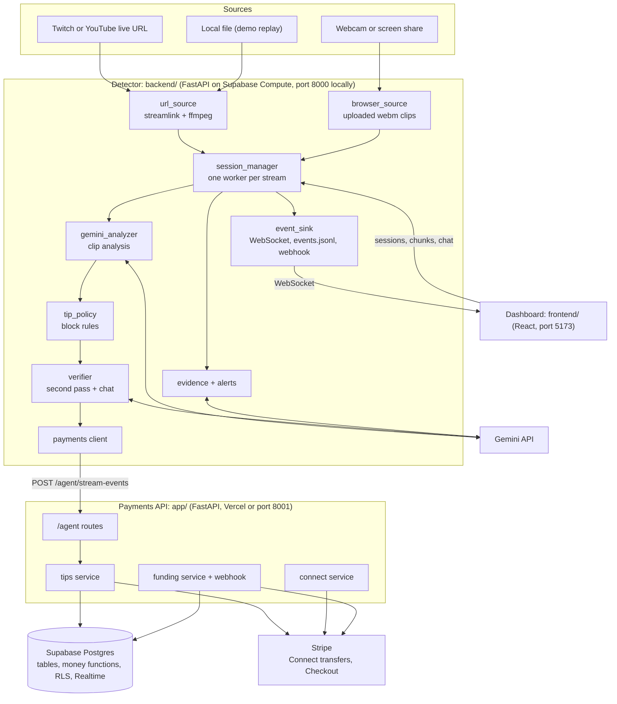
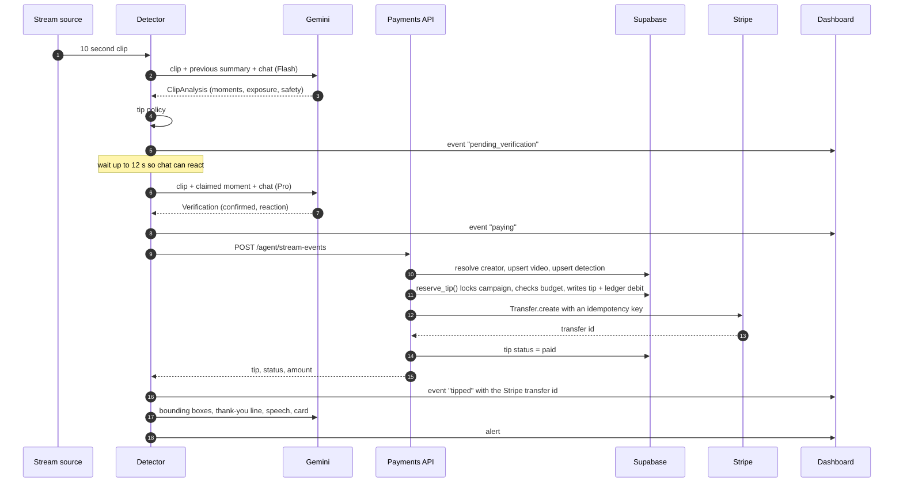
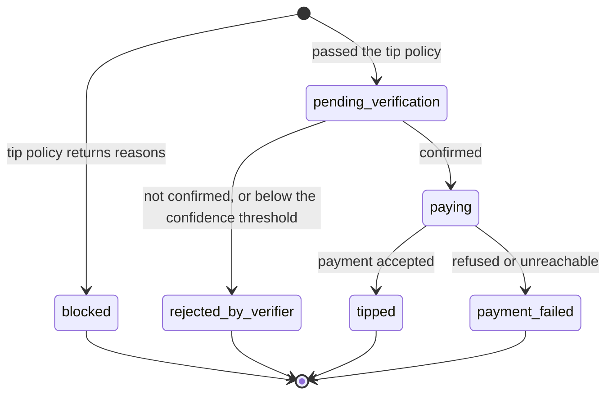

# Architecture

Suparade is two services and a database. The **detector** watches streams and decides which moments deserve a tip. The **payments API** owns the money: it records each moment in **Supabase** and pays the creator through **Stripe**. They talk over one HTTP call.

## Components

| Component | Files | Responsibility |
| --- | --- | --- |
| Sources | `backend/sources/` | Turn a stream into standalone clips. `url_source` pipes `streamlink` into `ffmpeg`, re-encodes to 480p and forces a keyframe at every segment boundary so each 10 second clip is a small playable mp4. A video in `backend/demo/` is replayed in real time. `browser_source` accepts webm clips the dashboard records with `MediaRecorder`. |
| Session manager | `backend/session_manager.py` | One session per stream. A single worker analyses clips in order so each clip can receive the previous clip's summary. Runs exposure accounting, the tip policy, verification and payment. |
| Analyzer | `backend/gemini_analyzer.py` | Sends one clip (video and audio) plus chat to Gemini with a JSON response schema. Retries 429 and 5xx responses with exponential backoff. |
| Tip policy | `backend/tip_policy.py` | Pure functions that return the reasons a moment is blocked. Holds per-session cooldown and repetition state. |
| Verifier | `backend/verifier.py` | A second, sceptical Gemini pass on a single candidate, with the chat around the moment. |
| Chat | `backend/chat.py` | Collects chat from Twitch (read anonymously), a demo script, or manual posts, stamped with wall-clock time. |
| Evidence and alerts | `backend/evidence.py`, `backend/alerts.py` | Saves the clip and a thumbnail for each paid event, asks Gemini for product bounding boxes, and in demo mode writes, speaks and illustrates a thank-you alert. |
| Payments client | `backend/payments.py` | Hands a confirmed tip to the payments API, with retries. Simulates tips when the API is not configured. |
| Event sink | `backend/event_sink.py` | Broadcasts to every connected dashboard, appends paid tips to `events.jsonl`, and optionally posts them to `EVENT_WEBHOOK_URL`. |
| Payments API | `app/` | Agent routes, creator onboarding, campaign funding, Stripe webhook. Uses the Supabase service role key. |
| Database | `supabase/migrations/` | Schema, three money functions, row level security, Realtime publication. See [DATA_MODEL.md](DATA_MODEL.md). |
| Dashboard | `frontend/` | Stream tiles, the flag feed, chat panel, evidence thumbnails with boxes, campaign budget in the header. |
| MCP server | `supabase/compute/mcp/` | MCP tools for agents: campaigns, brand sightings, tips, and the scout's status, start and stop. Reads Postgres with the service key Compute provides. Checks agent keys with the payments API. |
| Overlay | `supabase/compute/overlay/` | The OBS browser source. The viewer's browser subscribes to Realtime on `tips` and shows each paid tip. |

## The life of one moment

Timing: a moment is flagged roughly one clip length plus two to five seconds of model time after it happens. Payment follows once verification finishes, which waits for the chat reaction window when chat is active.

## Event states

Every moment the detector reports is a `BeverageEvent` with one of six states. The dashboard shows all of them, so a human can see what the agent declined to pay and why.

Sponsor screen-time bonuses skip verification: they go from the tip policy straight to `paying`.

## Staying live

- **One worker per stream.** Clips are analysed in order, one at a time, so context flows from clip to clip.
- **Backpressure.** If more than `MAX_BACKLOG` clips (default 3) are waiting, the oldest are skipped and reported as `skipped`, which keeps analysis close to live.
- **Payments never block analysis.** Verification, payment and enrichment run as background tasks.
- **Reservations.** A candidate reserves its cooldown slot before verification starts, so a later clip cannot double-tip while the verifier is running. The slot is released if the verifier rejects the moment or the payment fails.

## Failure handling and idempotency

Money moves at most once per moment, even when calls are retried.

| Layer | Mechanism |
| --- | --- |
| Detector to payments API | The call is idempotent on `event_id`. The detector retries network errors and 5xx responses up to `PAYMENTS_MAX_ATTEMPTS` (default 3). A 4xx is a definitive answer and is not retried. |
| Detection | Stored with a unique `idempotency_key` (`gemini:<event_id>`). Reporting the same event again returns the same row. |
| Tip | `tips.detection_id` is unique. `reserve_tip()` locks the campaign row, then returns the existing tip if one is already there. |
| Ledger | `wallet_ledger.ref` is unique (`tip:<id>`, `refund:<id>`, `checkout:<session>`), so a credit or debit can only be written once. |
| Stripe transfer | Sent with idempotency key `tip-<tip id>`. A retry returns the original transfer. |
| Stripe rejects the transfer | `fail_tip()` marks the tip failed and writes a refund to the ledger, returning the money to the campaign. |
| Stripe network error | The tip stays `pending`. Sending the same event again retries the transfer with the same idempotency key. |
| Gemini error | 429 and 5xx responses are retried with exponential backoff, up to `GEMINI_MAX_RETRIES`. A clip that still fails is reported as `error` and the stream continues. |
| Verification error | Treated as not confirmed. Nothing is paid. |

## Deployment

| Piece | Where | Why |
| --- | --- | --- |
| Payments API | Vercel (`api/index.py`, `vercel.json`) or any host running `uvicorn app.main:app` | Stateless request and response. `.vercelignore` keeps the detector out of the deployment. |
| Detector | Supabase Compute (`backend/Dockerfile`, `[compute.detector]` in `supabase/config.toml`, deployed by `scripts/deploy_detector.sh`), or locally | Needs ffmpeg, streamlink and long-running workers. Compute runs them in the same project as the database, with no time limit. One instance, because sessions live in memory. |
| MCP server | Supabase Compute (`supabase/compute/mcp/`, Dockerfile runtime, 2 GB, 1 vCPU, public) | Stateless. Stores no agent key: the payments API checks `X-Agent-Key`, and `X-Detector-Key` is passed through to the detector for start and stop. Never moves money. |
| Overlay | Supabase Compute (`supabase/compute/overlay/`, Node runtime, 2 GB, 1 vCPU, public) | Serves one page with the public URL and browser-safe key Compute provides. Row level security lets anyone read paid tips only. |
| Dashboard | Anywhere static files can be served, `npm run dev` (local detector) or `npm run dev:compute` (the detector on Supabase Compute, port 5174) | Talks to the detector over HTTP and WebSocket through the dev server's proxy, which adds `X-Detector-Key` on the server side. |
| Database | Supabase | Run the migrations in `supabase/migrations/` in order. |

The detector finds the payments API through `SUPARADE_API_URL`. Point it at the Vercel URL in production, or `http://localhost:8001` locally. The Compute container cannot reach localhost, so the deploy keeps only an `https://` URL; without one, tips are simulated.

The deployed detector has a public URL, so `DETECTOR_KEY` is set there: starting, feeding or stopping a session needs the `X-Detector-Key` header. Health, events and evidence stay open. Locally the key is empty and every endpoint is open.

## Design choices

- **Two Gemini passes.** A fast model sees every clip; a stronger model sees only the few candidates that survive the policy. This keeps cost and latency low while making the payment decision careful.
- **Money rules live in the database.** Budget checks, the per-tip cap and the one-tip-per-detection rule are enforced inside a Postgres function under a row lock, not in application code. Two concurrent tips cannot overspend a campaign.
- **An append-only ledger.** The campaign balance is the sum of ledger rows. There is no balance column to drift.
- **Blocked moments are shown, not hidden.** The reasons are part of the product: a brand can see what the agent refused to pay for.
- **The detector suggests, the payments API decides.** The detector proposes an amount; the payments API caps it at the campaign's `max_tip_cents` and checks the budget before any money moves.
