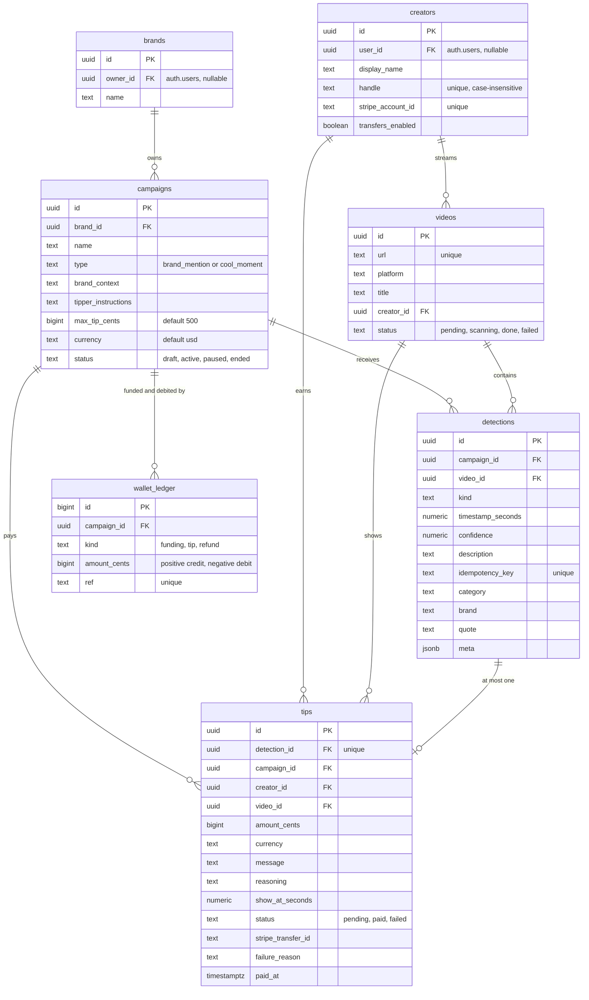

# Data model

Supabase Postgres is the system of record. Every rule about money is enforced inside the database, so no caller can overspend a campaign or pay a moment twice. The schema is in `supabase/migrations/`; run the three files in order.

## Tables

| Table | Purpose |
| --- | --- |
| `brands` | A brand and its owner. `owner_id` is nullable so the demo seed works without a signed-in user. |
| `campaigns` | A budget with rules: campaign type, context for the agents, extra guidance for the tipper, the per-tip cap, currency and status. |
| `creators` | A streamer who can be paid. `handle` is the streamer id typed in the detector dashboard. `stripe_account_id` and `transfers_enabled` track Stripe onboarding. |
| `videos` | A stream or video, stored as a URL only. Webcam and local demo sessions get a synthetic URL (`browser://<session>` or `local://<file>`). |
| `detections` | A moment worth tipping. `category`, `brand` and `quote` come from the Gemini detector, and `meta` holds its full event (verifier reason, chat reaction and more) for audits. |
| `tips` | One row per paid or attempted tip, with the on-screen message, the agent's reasoning and the Stripe transfer id. |
| `wallet_ledger` | Append-only money ledger per campaign. |

`campaign_balances` is a view: the sum of ledger rows per campaign. There is no stored balance column.

## Money functions

All three are `security definer`, pinned to the `public` search path, and executable only by the service role.

### `credit_campaign(campaign_id, amount_cents, ref)`

Writes a `funding` ledger row. `ref` is unique, so calling it twice with the same ref credits once. Returns true only when a new row was written. Called by the Stripe webhook with `checkout:<session id>` and by the dev credit route with `dev:<uuid>`.

### `reserve_tip(detection_id, amount_cents, message, reasoning, show_at_seconds)`

The heart of the money path. In a single transaction it:

1. Loads the detection, or raises `detection_not_found`.
2. Locks the campaign row with `for update`, so concurrent tips on one campaign queue up.
3. Returns the existing tip if this detection already has one. This check sits after the lock, so concurrent calls for the same detection collapse into one tip.
4. Requires the campaign to be `active`, or raises `campaign_not_active`.
5. Requires the amount to be positive and at most `max_tip_cents`, or raises `amount_out_of_range`.
6. Requires the video to have a creator (`video_has_no_creator`) whose Stripe account exists and has transfers enabled (`creator_not_payable`).
7. Sums the ledger and raises `insufficient_budget` if the balance does not cover the amount.
8. Inserts the tip as `pending` and a `tip` ledger row for the negative amount, with ref `tip:<tip id>`.

### `fail_tip(tip_id, reason)`

Marks a `pending` tip `failed` and writes a `refund` ledger row (`refund:<tip id>`) that returns the money to the campaign. Safe to call twice.

## Idempotency at a glance

| Thing | Unique key | Effect |
| --- | --- | --- |
| Video | `videos.url` | Registering the same stream again returns the same row |
| Detection | `detections.idempotency_key` | `gemini:<event_id>` from the detector, or a hash of campaign, video, kind and a 5 second window for the agent route |
| Tip | `tips.detection_id` | One tip per detection, ever |
| Ledger entry | `wallet_ledger.ref` | Each credit, debit and refund is written once |
| Stripe transfer | Idempotency key `tip-<tip id>` | A retry returns the original transfer |

## Row level security

Row level security is enabled on every table. The payments API uses the service role key, which bypasses it; the policies below are for browser clients using the anon or authenticated keys.

| Table | Who can do what |
| --- | --- |
| `brands` | Owners have full access to their own brands |
| `campaigns` | Owners have full access to campaigns under their brands |
| `detections` | Brand owners can read detections for their campaigns |
| `wallet_ledger` | Brand owners can read the ledger for their campaigns |
| `tips` | Brand owners can read all of their tips. Anyone can read tips with status `paid`, which powers a public on-stream pop-up |
| `creators`, `videos` | Readable by everyone, needed for an overlay. Written only by the backend |

Table privileges are granted explicitly in `20261003000100_table_grants.sql`: the service role gets full access, authenticated users can write `brands` and `campaigns` and read the rest, and anonymous users can read `creators`, `videos` and `tips`.

## Realtime

`tips` is added to the `supabase_realtime` publication. A client that subscribes to the table receives the update when a tip flips to `paid`, with the amount, the message and `show_at_seconds`, which says when in the video the pop-up should appear. Because paid tips are publicly readable, an overlay needs only the anon key.

The dashboard in this repository uses the detector's own WebSocket for its live feed. The Realtime publication is the integration point for a separate overlay or brand-facing frontend.

## Auth

The payments API verifies dashboard users by passing their Supabase access token to `auth.get_user`. Ownership checks (a campaign belongs to the caller's brand; a creator profile belongs to the caller) are done in the API before any Stripe call.

## What to look at after a demo run

| Table | What you will see |
| --- | --- |
| `detections` | The moment, with `category`, `quote` and the full Gemini event in `meta` |
| `tips` | The tip with status `paid`, its message, reasoning and `stripe_transfer_id` |
| `wallet_ledger` | A negative `tip` row for the debit, alongside the `funding` credits |
| `campaign_balances` | The budget left |
